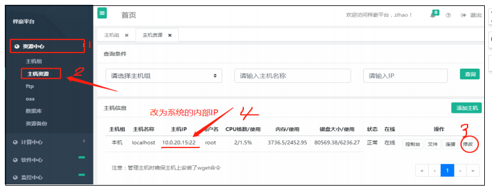
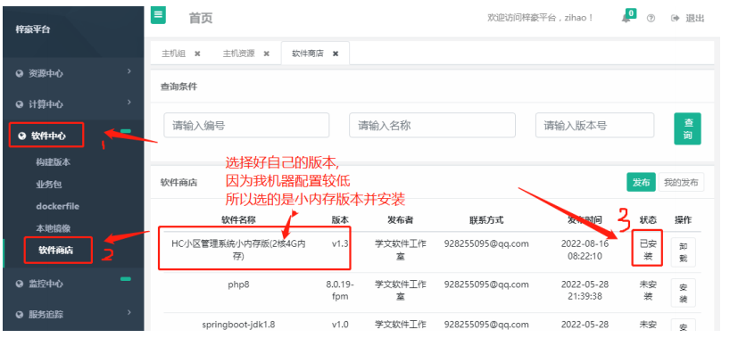
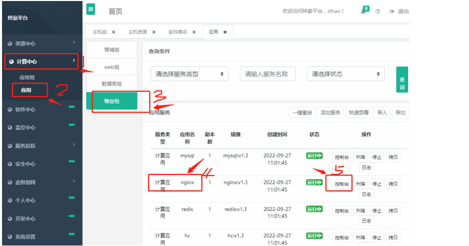
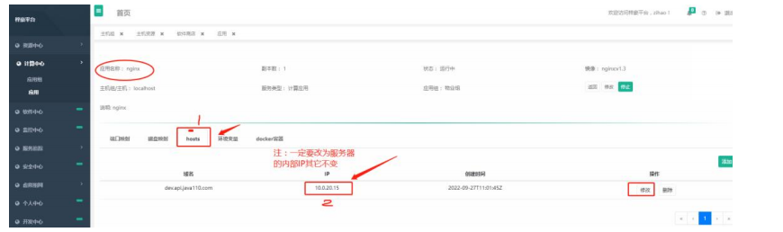
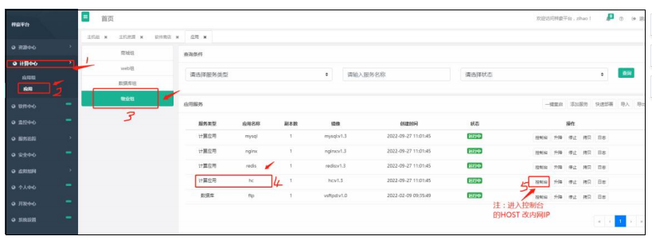
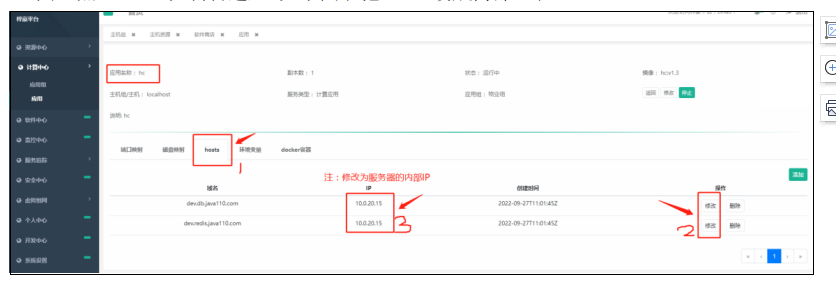
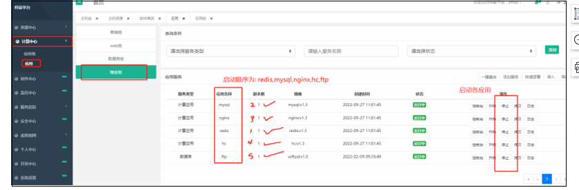
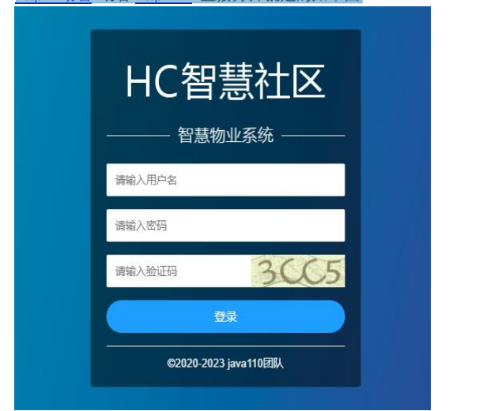

# 智慧小区 HC 系统安装配置简单流程(V2022-09-28)  

我的系统为： conetos 8.2(官方建议 7.6 版本较稳定)  
登陆空间系统打开 SSH 终端#  

第一步骤 1：先安装梓豪平台  
1.1:梓豪平台安装是非常简单的，我们可以通过以下命令  
直接安装:  
yum install -y wget && wget https://homecommunity.oss-cn-beijing.aliyuncs.com/install.sh -O zihaoinstall.sh && sh zihaoinstall.sh  
等待安装完成  

第二步骤: 等梓豪平台系统安装完以后，然后登陆进入梓豪平台  
浏览器访问 http://ip:7000 账号为 zihao 密码为 123456  
在梓豪平台系统资源中心，主机资源里面进去修改服务器 IP(一定要改为内部IP)如下图  
  

第三步骤安装 HC 等相关应用：然后在软件商店里面去安装两个 4G 小内存存版的 HC（因我的服务器配置不搞选的是小内存版）如下图

第四步骤:安装完装完相关应用以后，然后在计算机应用下的 nginx 那个应用下面的 host 选
项里面去，把那个 IP 改成自己服务器的内网(如下图 1,2)
01 图: 进入 nginx 控制台

 02 图: 点 NGINX 控制台进入(第五步操作)如下图( 改成内部 IP)

第五步骤: 然后再在计算机应用下的”hc”那个应用下面的 host 选项里面去，把那个 IP 改成
自己服务器的内网(如下图 1,2)
01 图: 进入”hc”控制台

02 图: 点”hc” 控制台进入 如下图( 把 HOST 改成内部 IP)

第六步骤:全部改好后，按顺序把相应的应用服务按顺序启动就可以了，
（
注启动顺序为“redis,mysql,nginx,hc,ftp）如下图

最后打开物业管理系统网址直接登陆上去（注：用户名与密码为.admin,admin,开发账号 dev/admin 物业账号通过 添加物业公司生成）
http://域名 或者 http://IP 直接打开就是的如下图

问题解答：

1. 需要关闭防火墙和安装iptables，否则无法访问7000端口和无法安装容器

sudo yum install -y net-tools
sudo systemctl stop firewalld     # 立即停止防火墙
sudo systemctl disable firewalld  # 禁止开机自动启动防火墙
sudo systemctl mask firewalld     # 防止被其他服务重新启动

sudo modprobe iptable_nat
sudo modprobe ip_tables
sudo modprobe nf_nat
sudo systemctl restart docker

2. 配置 Nginx 挂载配置文件内容，否则Nginx容器无法启动